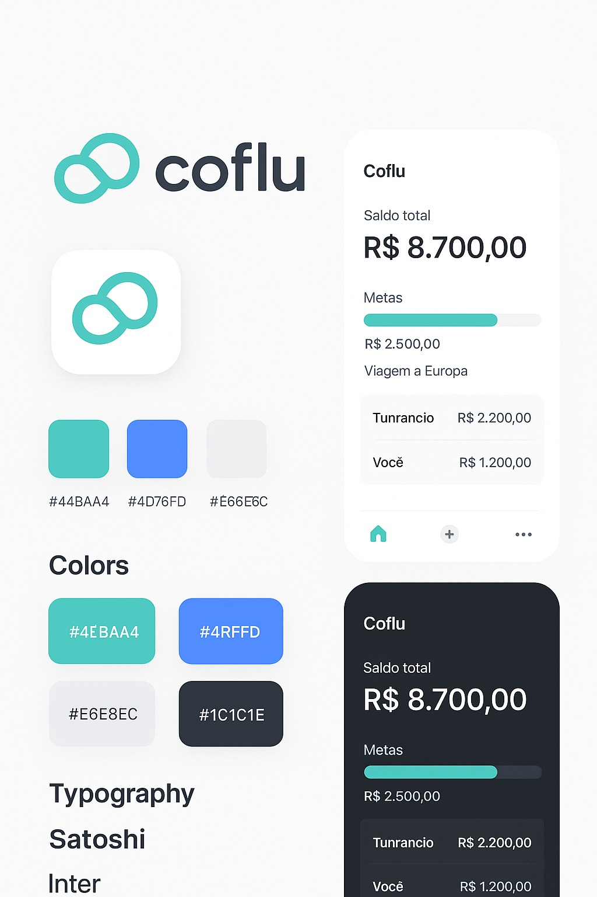

# 🌀 Coflu

O **Coflu** é um aplicativo de **finanças pessoais e familiares** com foco em colaboração.  
Permite que casais ou grupos familiares administrem juntos suas finanças, metas e gastos, de forma **inteligente, leve e minimalista**.

---

## ✨ Visão Geral

O Coflu surgiu com a proposta de **transformar a gestão financeira compartilhada** em algo simples e visual.  
Inspirado em conceitos de ERPs pessoais, ele permite que membros da família ou casal controlem gastos, definam metas e tomem decisões financeiras em conjunto.

---

## 🎨 Identidade Visual

A identidade visual foi pensada para transmitir **leveza, confiança e modernidade**, combinando tons suaves com tipografia minimalista.

### **Cores Principais**
| Nome | Cor | Código |
|------|------|---------|
| Verde Principal | 🟩 | `#4EBAA4` |
| Azul Acento | 🟦 | `#4RFFD` |
| Cinza Claro | ⚪ | `#E6E8EC` |
| Preto Suave | ⚫ | `#1C1C1E` |

### **Fontes**
- **Satoshi** — para títulos e elementos de destaque  
- **Inter** — para textos e conteúdos

---

## ⚙️ Tecnologias Utilizadas

- **React + Vite**
- **Tailwind CSS**
- **Javascript**
- **Lucide Icons**
- **Figma (Design System)**

---

## 🚀 Funcionalidades Planejadas

- [ ] Interface responsiva e minimalista  
- [ ] Cálculo automático de metas e saldos compartilhados  
- [ ] Modo claro/escuro  
- [ ] Integração com APIs bancárias  
- [ ] Login e sincronização multiusuário  
- [ ] Dashboard familiar  

---

## 📂 Estrutura do Projeto

